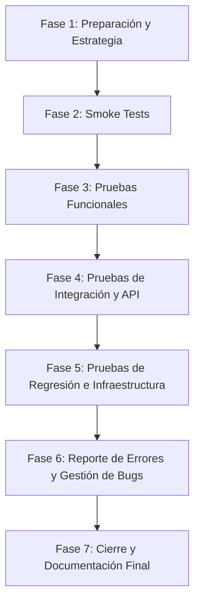

# Hoja de Ruta de QA (QA Roadmap) — NextEvent

Este documento define las fases estratégicas del proceso de aseguramiento de calidad (QA) para la plataforma **NextEvent**. Como equipo de QA, validamos de manera rigurosa la entrega del software utilizando una mezcla de pruebas manuales, automatización de APIs e integración.

---

## 📅 Fases del Ciclo de Vida de Pruebas

### 📑 Fase 1: Preparación y Estrategia (Actual)
* **Objetivo:** Definir el alcance, analizar las brechas del sistema (backend vs frontend) y preparar los artefactos base de QA.
* **Entregables:**
  * [Plan de Pruebas (TEST_PLAN.md)](file:///c:/Users/lenin/Documents/is/NextEvent/qa/TEST_PLAN.md)
  * [Checklist de Calidad (QA_CHECKLIST.md)](file:///c:/Users/lenin/Documents/is/NextEvent/qa/QA_CHECKLIST.md)
  * [Plantilla de Reporte de Errores (BUG_REPORT_TEMPLATE.md)](file:///c:/Users/lenin/Documents/is/NextEvent/qa/BUG_REPORT_TEMPLATE.md)
* **Estado:** 🟡 En Progreso.

### 💨 Fase 2: Smoke Tests (Pruebas de Humo)
* **Objetivo:** Asegurar que los servicios base (Backend, Base de Datos, Frontend) estén arriba y respondan a las operaciones críticas (registro, login, salud del sistema).
* **Entregables:**
  * Postman Environment configurado (`NextEvent.postman_environment.json`).
  * Postman Collection de Humo (`NextEvent_Smoke_Tests.postman_collection.json`).
  * Evidencia de ejecución exitosa en local (Newman o consola de Postman).

### 🧪 Fase 3: Pruebas Funcionales (Functional Tests)
* **Objetivo:** Validar que las reglas de negocio descritas en `openapi.yaml` y la UI del frontend se comporten de forma correcta según las historias de usuario de Jira.
* **Estrategia ante brechas:**
  * Módulos con backend (`Auth`, `Events`): Pruebas manuales y automatizadas sobre la lógica real del sistema.
  * Módulos hardcoded en frontend (`Venues`, `Guests/RSVP`, `Photos`): Pruebas de usabilidad en la UI y diseño de casos de prueba técnicos teóricos basados en OpenAPI para su posterior validación.
* **Entregables:**
  * Matriz de Trazabilidad (Jira User Story vs Caso de Prueba).
  * Suite de Casos de Prueba Funcionales documentados (Casos Felices y Alternativos).

### 🔗 Fase 4: Pruebas de Integración y API
* **Objetivo:** Probar los flujos de extremo a extremo que requieran secuencias de múltiples endpoints REST, validando el comportamiento de Spring Security (tokens JWT), la persistencia en PostgreSQL con Flyway, y la estructura de las respuestas.
* **Entregables:**
  * Postman Integration Collection con scripts JavaScript de aserción (`pm.test`).
  * Pruebas de integración de API simuladas o documentadas en la suite de pruebas.

### 🐳 Fase 5: Pruebas de Regresión e Infraestructura
* **Objetivo:** Garantizar que los cambios en el pipeline de CI/CD (GitHub Actions) y la configuración de Docker (Docker Compose y variables de entorno) no rompan la estabilidad general de la aplicación.
* **Entregables:**
  * Validación del despliegue Docker y variables de entorno.
  * Reporte de ejecución de pruebas de regresión automáticas en pipelines.

### 🐛 Fase 6: Reporte de Errores y Gestión de Bugs
* **Objetivo:** Registrar, categorizar y documentar de manera profesional todos los fallos funcionales, de interfaz e inconsistencias técnicas detectadas entre backend/frontend.
* **Entregables:**
  * Reporte detallado de Bugs (`BUG_REPORT.md`).
  * Tickets mockeados de Jira para su asignación a desarrollo.

### 🏆 Fase 7: Cierre y Documentación Final
* **Objetivo:** Entregar las evidencias consolidadas requeridas para el cierre del ciclo de desarrollo y la presentación del proyecto.
* **Entregables:**
  * Manual de QA (Guía técnica para correr las pruebas).
  * Reporte de Cobertura Funcional y Checklist final firmado.
  * Informe Final de QA y Lecciones Aprendidas.

---

## 🛠️ Herramientas Utilizadas en NextEvent QA
* **Gestión & Diseño:** Jira (Scrum), Git/GitHub (Rama `feature/qa-testing`).
* **Pruebas de API & Automatización:** Postman, Postman CLI / Newman.
* **Infraestructura & Contenedores:** Docker, Docker Compose, Flyway, PostgreSQL.
* **Documentación:** Markdown técnico.
